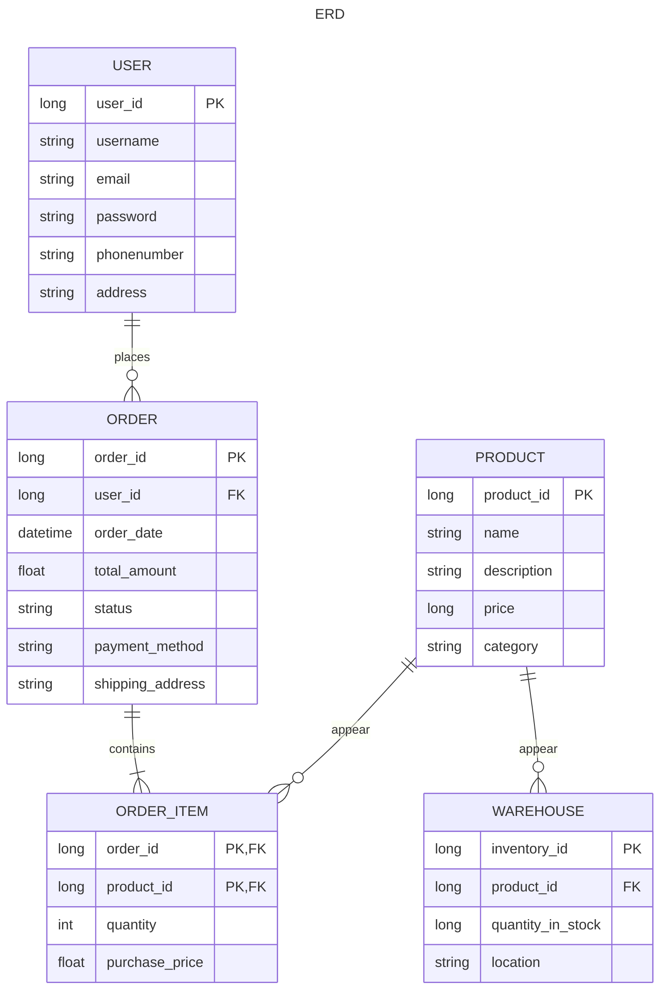
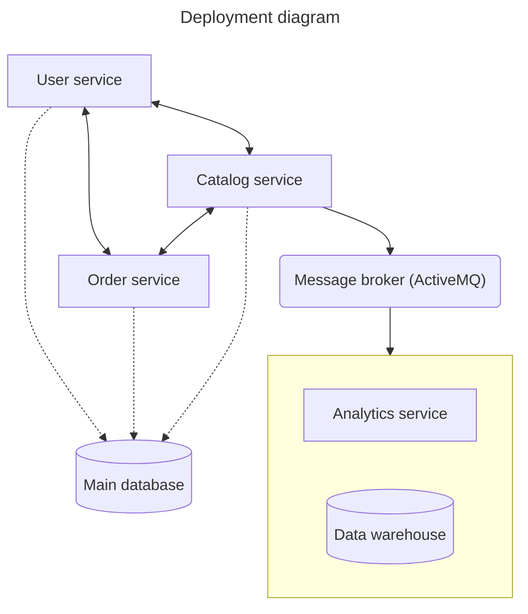

### **This repo is for a Java training program.**

```mermaid
---
title: ERD
---
erDiagram
    USER {
        long user_id PK
        string username
        string email
        string password
        string phonenumber
        string address
    }
    ORDER {
        long order_id PK
        long user_id FK
        datetime order_date
        float total_amount
        string status
        string payment_method
        string shipping_address
    }
    ORDER_ITEM {
        long order_id PK, FK
        long product_id PK, FK
        int quantity
        float purchase_price
    }
    PRODUCT {
        long product_id PK
        string name
        string description
        long price
        string category
    }
    WAREHOUSE {
        long inventory_id PK
        long product_id FK
        long quantity_in_stock
        string location
    }

    USER only one to zero or more ORDER : places
    ORDER only one to one or more ORDER_ITEM : contains
    PRODUCT only one to zero or more ORDER_ITEM: appear
    PRODUCT only one to zero or more WAREHOUSE: appear
```

```mermaid
---
title: Deployment diagram
---
graph
    US[User service]
    OS[Order service]
    CS[Catalog service]
    AS[Analytics service]
    MB("Message broker (ActiveMQ)")
    MD[(Main database)]
    DW[(Data warehouse)]
    subgraph A [ ]
    AS
    DW
    end
    US <--> CS & OS
    CS <--> OS
    US -.-> MD
    OS -.-> MD
    CS -.-> MD
    CS --> MB
    MB --> A
```
